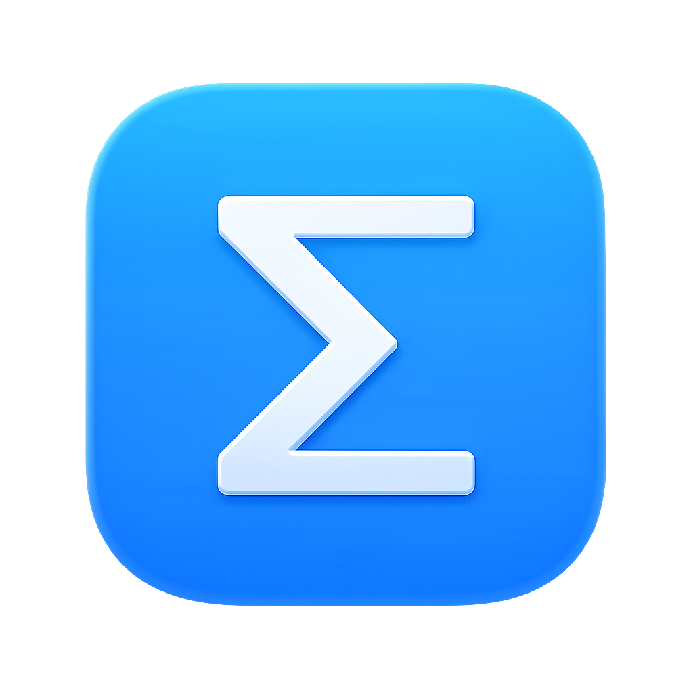
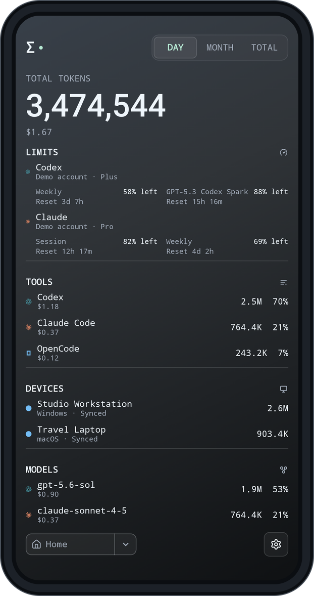
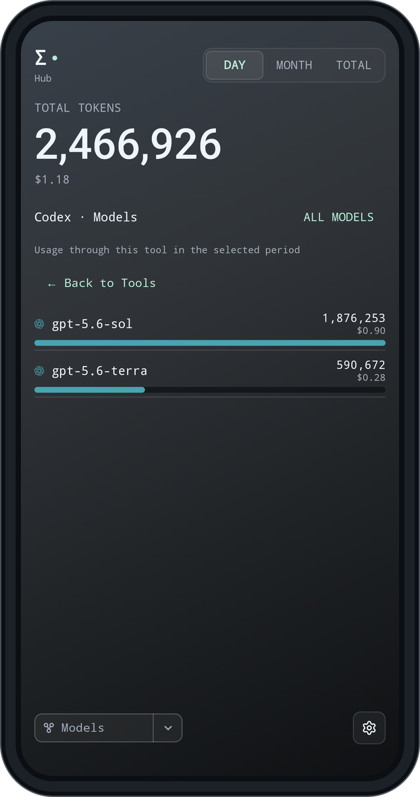
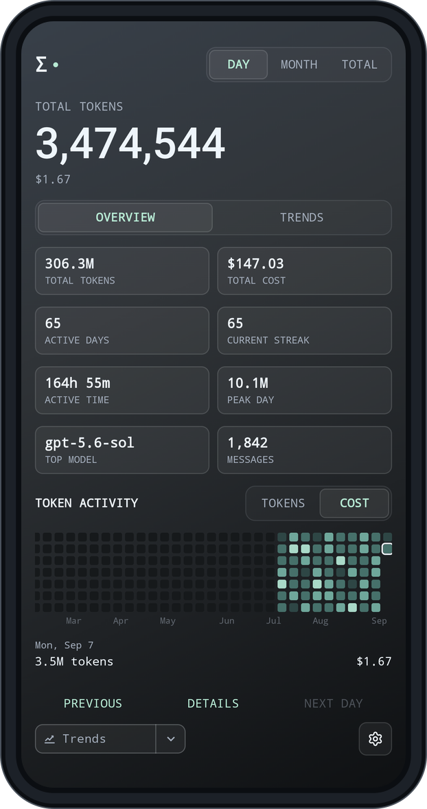
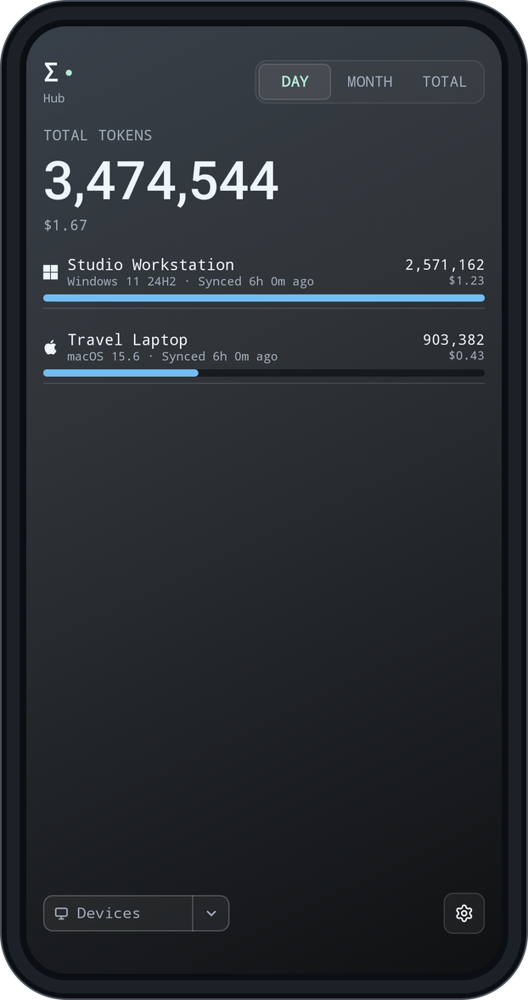
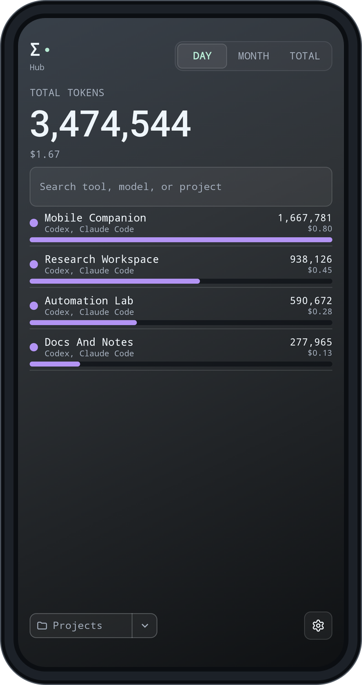
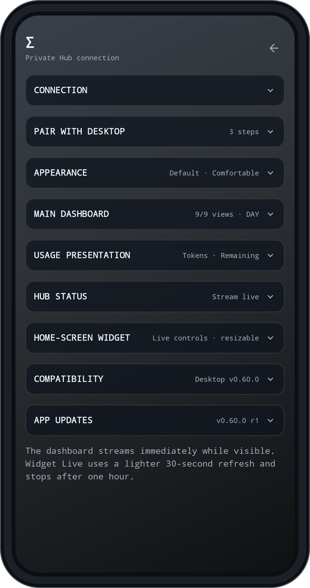
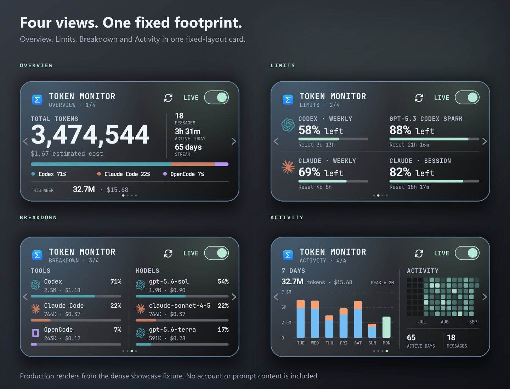
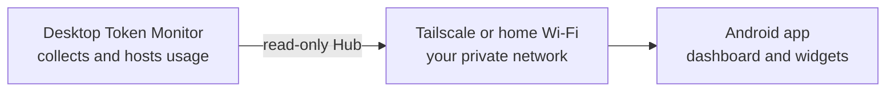

<p align="center">
  
</p>

<h1 align="center">Token Monitor for Android</h1>

<p align="center"><b>Your desktop usage. In your pocket.</b><br>
Tokens, account limits, models and trends from the desktop Token Monitor Hub, plus home-screen widgets that stay useful with the app closed.</p>

<p align="center">
  <a href="docs/INSTALL.md">Build or install</a> ·
  <a href="docs/PAIRING.md">Pair with your desktop</a> ·
  <a href="docs/WIDGETS.md">Widgets</a> ·
  <a href="CHANGELOG.md">What changed</a>
</p>

<p align="center">
  <a href="https://github.com/The-Minion-oOo/token-monitor-android/actions/workflows/android.yml"></a>
  
  
  
  <a href="LICENSE"></a>
</p>


Your desktop [Token Monitor](https://github.com/Javis603/token-monitor) already
tracks the usage. This app brings the same dashboard, visual language, and
numbers to your phone, with home-screen widgets for quick checks.

The desktop stays the collector and the source of truth. The phone reads its Hub over your own private network and shows what it finds. That is the whole trick.

## The desktop dashboard, made mobile

<table>
  <tr>
    <td align="center" valign="top" width="33%"><a href="docs/images/home.png"></a><br><sub><b>Command center</b><br>Totals, limits, tools, devices, models</sub></td>
    <td align="center" valign="top" width="33%"><a href="docs/images/filtered-models.png"></a><br><sub><b>Tap a tool</b><br>See the models behind it</sub></td>
    <td align="center" valign="top" width="33%"><a href="docs/images/trends.png"></a><br><sub><b>Find the busy days</b><br>Cards, heatmap, daily series</sub></td>
  </tr>
  <tr>
    <td align="center" valign="top" width="33%"><a href="docs/images/devices.png"></a><br><sub><b>Every desktop</b><br>What each machine contributes</sub></td>
    <td align="center" valign="top" width="33%"><a href="docs/images/projects.png"></a><br><sub><b>Projects and sessions</b><br>Searchable, without transcripts</sub></td>
    <td align="center" valign="top" width="33%"><a href="docs/images/settings.png"></a><br><sub><b>Make it yours</b><br>Themes, text size, motion, views</sub></td>
  </tr>
</table>

> Every image is a capture of the Android app using made-up accounts, devices,
> projects, and usage. Capture instructions are in the [development guide](docs/DEVELOPMENT.md#showcase-captures).

## One fixed card, four focused pages

<a href="docs/images/widget-pages-gallery.png"></a>

**Token Monitor · Pages** is the redesigned widget shown above. It requests a
wide 4×2 placement and always draws the same 1.82:1 composition. Android launchers
can allocate different physical dimensions, and some may still show resize handles,
but the Pages widget does not reflow, add rows, or switch layouts.

- **Overview** keeps the complete token total, cost, recent activity, streak, tool
  share, and week summary together.
- **Limits** shows the four tightest reported account windows with their reset or
  expiry wording.
- **Breakdown** compares up to three tools and three models on one shared row rhythm.
- **Activity** pairs the labeled seven-day chart with a thirteen-week heatmap and
  recent activity totals.

Tap the left or right edge to change pages. The selected page and four position
dots update locally without waking the Hub or starting background work. Refresh
performs one bounded fetch; Live checks current stats every 30 seconds for up to
one hour and can be stopped from the widget or its notification. When the Hub is
offline, the last snapshot remains visible with a `SAVED` status.

The widget picker also includes the original **Token Monitor · Usage** widget. It
is a separate responsive provider that reflows a single summary as its launcher
allocation changes; its layouts are not alternate sizes of the four Pages shown
above. Both widgets follow the app theme, including desktop `TM1-…` theme codes.

[Widget behavior and controls](docs/WIDGETS.md) · [Widget design notes](docs/WIDGET_DESIGN.md).

## How it works



The phone talks to the Hub the desktop already runs. It reads five documented
endpoints and one live stream over Tailscale, or home Wi-Fi when enabled. There
is no public server, vendor relay, or separate Token Monitor account.

## What it shows

- Live totals while the app is open, an immediate refresh on return, pull-to-refresh, and a saved snapshot when the Hub is unavailable.
- Day, week, month, rolling 7, 30 and 90 days, one year, all history and total.
- Account limits with the desktop's reset countdowns.
- Tools, devices, models, projects, sessions, subscriptions, service status, activity and trends, each with an `updated 5m ago` freshness.
- Session activity and context-window use when desktop v0.61.0 reports them, without reading prompt or response text.
- Trends by tool or model, shown as bars or a K-line chart.
- Cache hit, cache miss, output and unclassified token details where the Hub provides them.
- The desktop's Default, Obsidian and Porcelain themes, theme codes pasted as-is, an option to follow the phone's light and dark setting, three text sizes, motion controls, and reorderable views and Home modules.
- A Back button that goes Home instead of quitting on you, and a light haptic tick on every tab.

The Hub deliberately does not carry prompt or response text, so the phone never sees it. Your conversations stay on your desk.

## Private and light

- Read-only. The app cannot change desktop settings, usage data, or files.
- Hub credentials live in an Android Keystore-backed store and are excluded from backups.
- No ads, analytics, wake lock, scheduled background work or "please rate us" popup.
- The visible dashboard streams immediately. Widget Live uses a lightweight 30-second stats refresh and stops after one hour.
- Android 13 and newer asks for notification permission the first time you start a widget session, so the Stop control has somewhere to live. Ordinary use needs no permission prompts at all.

[Privacy and security](docs/SECURITY.md) · [Report a concern](SECURITY.md).

## Get connected

You need Android 8.0 or newer and a desktop running Token Monitor v0.61.0 with Hub hosting on.

1. Follow [Installing and updating](docs/INSTALL.md). v0.61.0 r1 is the current
   source candidate; v0.60.0 r7 remains the published build until the signed
   candidate completes its phone upgrade gate.
2. Put [Tailscale](https://tailscale.com/) on the desktop and the phone, signed into the same tailnet.
3. In desktop Token Monitor, open **Settings → Multi-device Sync → Host Hub** and copy the address and shared secret.
4. In the app, type the address that starts with `100.`, paste the secret, tap **Connect**. Just the numbers are enough.
5. At home, tap **Find** and the app fills in the desktop's Wi-Fi address as a fallback. From then on the phone uses whichever route answers.

[Pairing and troubleshooting](docs/PAIRING.md) · [Installing and updating](docs/INSTALL.md).

## Compatibility

| | |
| --- | --- |
| Current public release | [`v0.60.0-r7`](https://github.com/The-Minion-oOo/token-monitor-android/releases/tag/android-v0.60.0-r7) |
| Current source candidate | `v0.61.0-r1` ([release notes](docs/releases/android-v0.61.0-r1.md)) |
| Latest phone-verified build | [`v0.60.0-r7`](docs/releases/android-v0.60.0-r7.md); v0.61.0 r1 pending |
| Verified desktop baseline | Token Monitor `v0.61.0` |
| Upstream commit | [`dc3cc13`](https://github.com/Javis603/token-monitor/commit/dc3cc1321d9490873ff96abb662e07eecea75751) |

The visible version matches the desktop release the phone understands. Android-only
builds bump the release revision and internal version code while the compatibility
line stays on its verified desktop version. When desktop Token Monitor moves past that, the phone
continues using the verified endpoints until a follow-up Android release checks
the new protocol. Details are in [`upstream.json`](upstream.json) and
[`RELEASING.md`](docs/RELEASING.md).

## Build and contribute

JDK 17 or newer, Android SDK 37 and the bundled Gradle wrapper:

```powershell
.\gradlew.bat :app:testDebugUnitTest :app:lintDebug :app:assembleDebug
```

Add `-PtokenMonitorPreview=true` to install a separate `.preview` build next to the release without touching its pairing. [Development guide](docs/DEVELOPMENT.md) · [Contributing](CONTRIBUTING.md).

## Documentation

| Using it | Understanding it | Maintaining it |
| --- | --- | --- |
| [Installation](docs/INSTALL.md) | [Architecture](docs/ARCHITECTURE.md) | [Development](docs/DEVELOPMENT.md) |
| [Pairing](docs/PAIRING.md) | [Hub protocol](docs/PROTOCOL.md) | [Validation](docs/VALIDATION.md) |
| [Widgets](docs/WIDGETS.md) | [Desktop parity](docs/DESKTOP_PARITY.md) | [Releasing](docs/RELEASING.md) |
| [Privacy](docs/SECURITY.md) | [Widget design](docs/WIDGET_DESIGN.md) | [Following upstream](docs/UPSTREAM_SYNC.md) |

This project is independent of the upstream Token Monitor maintainers and of the services whose marks appear in the app. [MIT License](LICENSE) · [Third-party notices](THIRD_PARTY_NOTICES.md).

<p align="center">
  Made with ❤️ by <a href="https://github.com/The-Minion-oOo"><b>The_Minion_oOo</b></a><br>
  <sub>...: Thanks to Codex and Claude :...</sub>
</p>
