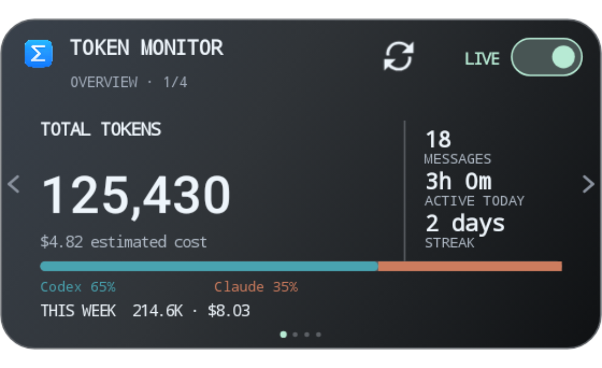
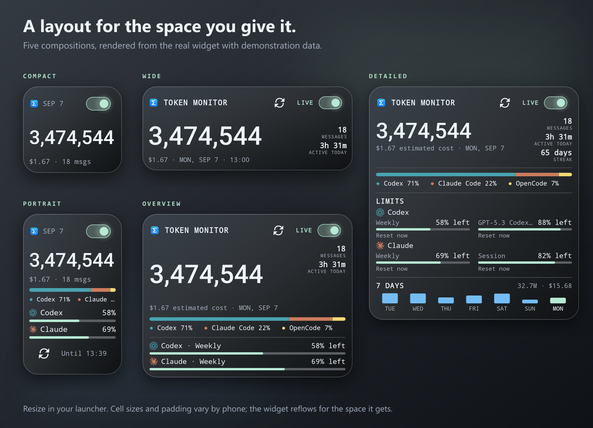

# Home-screen widgets

Add Token Monitor from your launcher's widget picker. The existing responsive widget
starts at 2×2 cells and is also available from Settings → Home-screen widget. A
separate **Token Monitor · Pages** entry requests 4×2 and shows four manually
selectable information pages. Long-press either widget and use the launcher's
resize handles to change its shape.

## What fits where

| Layout | Minimum content space | Content |
| --- | --- | --- |
| Compact | 110×110 dp | Date and the Live toggle, the full count, cost and message count; with more height, the tool split and the tightest window, then a Refresh icon with the saved time |
| Wide | 240×116 dp | Brand header with Refresh, status and the toggle; count, cost and date beside two stats |
| Portrait | 110×240 dp | Compact content plus a second provider window |
| Overview | 240×190 dp | Brand header, count with two stats beside it, tool split, the tightest window (a second from 221 dp), and the seven-day chart from 301 dp |
| Detailed | 250×384 dp | Overview content plus three stats, every limit window with its reset in two columns, and the week total on the chart |

The pages widget is intended for medium and large placements from 250×180 dp.
Its fixed manual order is **Overview → Limits → Breakdown → Activity**. All four
pages are rendered from one saved or Live snapshot into identical 1.82:1 full-card
images. The launcher receives only the selected image, so it cannot shrink or fan
the pages as a collection. Tap the left or right edge to change the active page;
the four dots show its position. Page changes never start a request, timer,
auto-rotation loop, or wake lock.

| Page | Content |
| --- | --- |
| Overview | Total tokens, estimated cost, messages, active time, streak, tool share, and week summary |
| Limits | Up to four tightest account windows with remaining quota and reset or expiry wording |
| Breakdown | Ranked tool and model totals with proportional bars and provider colors |
| Activity | Labeled seven-day token and cost bars, a labeled 13-week heatmap, active days, and messages |

The complete four-page gallery is shown in the project [README](../README.md#four-views-one-steady-footprint).

These are content dimensions, not launcher cells. Pixel, One UI and other launchers
size their cells differently and add their own padding, so the same 2×2 request can
land in Compact on one phone and Portrait on another. Larger system text raises the
height the Portrait, Overview and Detailed layouts need; a widget that no longer fits
drops to the next layout down rather than clipping.

The widget is set in the dashboard's own type: monospace labels and section titles,
a tabular sans-serif figure, and the same `Reset 1d 13h` countdowns the app shows.
The card takes the launcher's system corner radius on Android 12 and newer. Quota
bars and the seven-day chart are drawn at the exact pixel size the launcher reports
for the widget, so nothing is scaled after the fact and edges stay sharp at any size.
All four pages share the same text roles and supporting-label contrast. Long names
truncate instead of forcing a smaller page-specific type scale, and sparse Breakdown
data remains top-aligned rather than stretching across the card.

Stats beside the figure are today's messages and active time from the Hub's history,
the current streak, and the week's tokens when a day has none of those. The tool bar
splits today's tokens by tool in the vendor colors the app uses. The detailed layout
lists every reported window, two per provider, with the tightest first; the smaller
layouts show the lowest remaining window for each of up to two providers, which is
what the dashboard's Home module leads with. Percentages are remaining quota
as the Hub reports it; they are not inferred from token costs. A window under 35 percent
turns orange and under 15 percent red, matching the app. If the Hub supplies no limits,
the widget says so. The chart uses calendar days ending on the snapshot date; a dash
marks a day with no recorded data rather than a measured zero.

## Saved, Refresh and Live

The controls live in the header: a refresh icon with no visible button circle and a
Live toggle. Both retain 48 dp touch targets. The
toggle's knob sits left and grey while Live is off, and right with a soft glow in the
accent color while a session is connected. Tapping anywhere else on the card opens
the app.

| State or action | What happens |
| --- | --- |
| Saved | Shows the last received snapshot with its time beside the toggle. No widget-owned connection is active. |
| Refresh | Starts one bounded fetch and stops after completion or a 45-second timeout. |
| Live | Reads current Hub stats every 30 seconds for up to one hour while the dashboard is closed. |
| Stop | Tap the toggle again, or Stop in the notification. The dashboard can still stream while it is open. |

The label beside the toggle reads `LIVE` in the accent color while a session is
connected, `CONNECTING` or `UPDATING` while one is in progress, and `SAVED · 18:17`
otherwise. The narrow layouts drop the label and keep the toggle. Accessibility labels carry the full state and
the saved timestamp. Figures come from the snapshot date, which may be older than
today when the phone has been offline; Live does not invent intermediate readings,
and the count rolls only when the total actually changes.

While a session runs, its notification carries the figure, today's cost, and the
tightest window per provider with its reset, updated only when that visible content changes. On
Android 16 it is a promoted ongoing notification, which is what One UI shows under
"Live notifications" and on the lock screen, with a status bar chip carrying the
compact figure. Tap it to open the app; Stop ends the session.

The widget is also eligible for the lock screen on launchers that offer third-party
widgets there. Whether yours does depends on the launcher, not the app.

On Android 13 and newer, starting Live or Refresh asks for notification permission
once, so the Stop control has somewhere to live. Declining leaves the dashboard and
saved widgets working. A killed process, the hour expiring, or removing the last
widget ends the session. There is no automatic restart, wake lock, page rotation, or updating
outside the explicit foreground session.

## Troubleshooting

- **The widget kept its old shape after an update:** its dimensions belong to the
  launcher. Resize it, or remove and add it again.
- **The picker shows an older preview:** close and reopen the picker. Do not clear
  app data just to refresh a preview; that would also remove pairing.
- **Live says connecting:** check that the desktop Hub is running and reachable over
  Tailscale or your allowed private network. The dashboard's connection status has
  the details.
- **The count uses smaller type:** full comma-separated numbers shrink to fit. A
  wider widget gives them room; the count is never abbreviated.
- **Changing colors:** choose a theme in Settings → Appearance. Widgets follow
  Default, Obsidian, Porcelain and pasted desktop theme codes, and saved widgets
  recolor without a new fetch. With **Follow phone light and dark** on, a widget
  picks up a day/night switch at its next update: opening the app, Refresh, Live,
  or the phone changing mode while the app process is alive. The launcher picker
  uses a static Default sample.

Current verification and phone limitations: [VALIDATION.md](VALIDATION.md).
